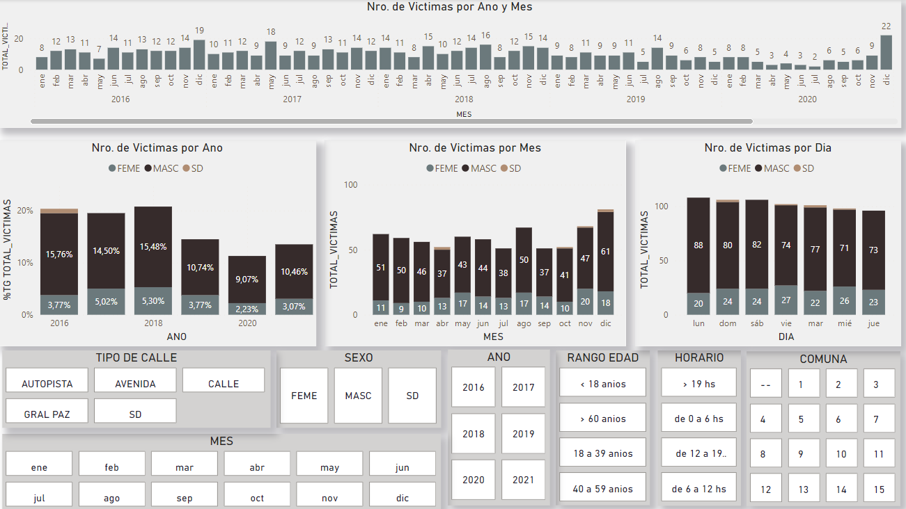
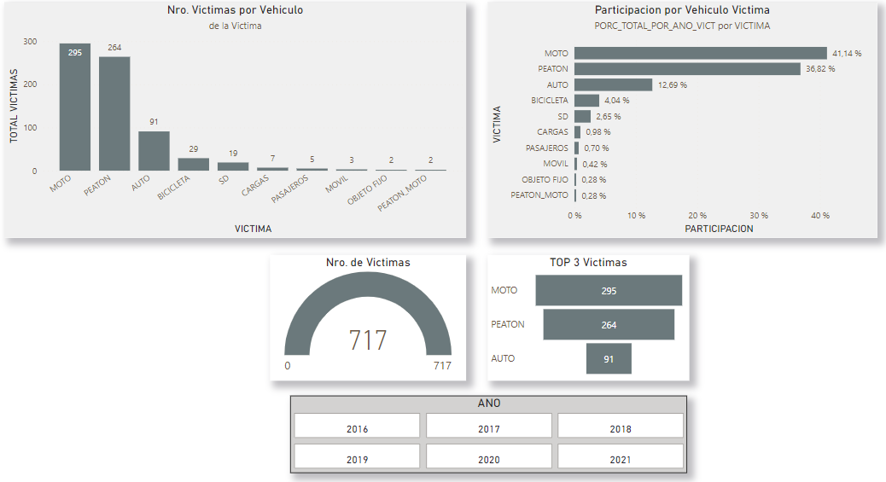
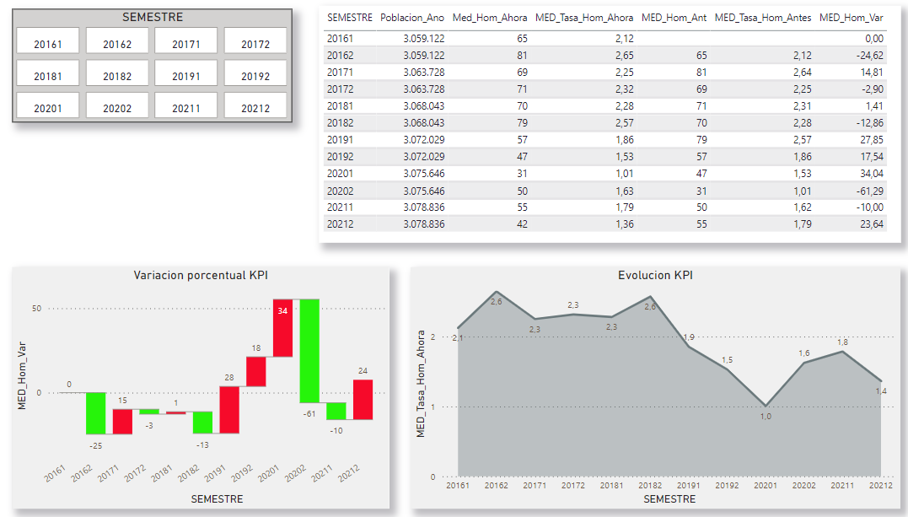
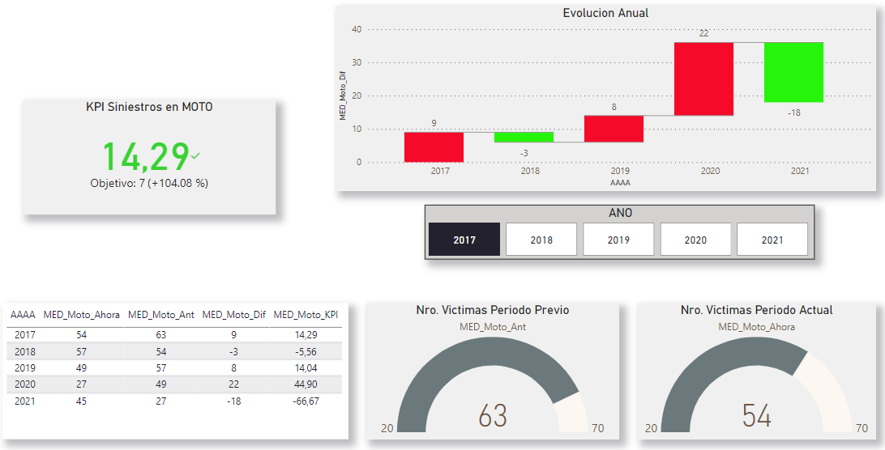
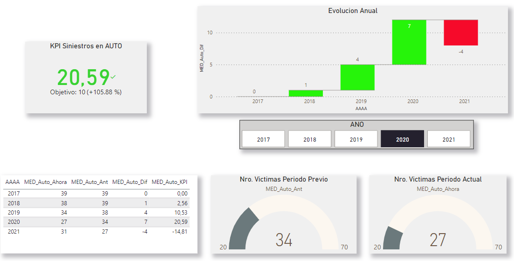

# 
 Analisis de Siniestros Viales

### 
Ciudad Autonoma de Buenos Aires, Argentina

### 
2016 - 2021

## Indice rapido
- [Acerca del Estudio](#acerca-del-estudio)
- [Resumen Ejecutivo](#resumen-ejecutivo)
- [Fuentes de los Datos y Webs de apoyo](#fuentes-de-los-datos-y-webs-de-apoyo)
- [Metodologia general de trabajo](#metodologia-general-de-trabajo)
- [KPI's](#key-performance-indicators)
- [Autor](#autor)

## Acerca del Estudio

A continuacion se presentan los resultados del analisis de la informacion suministada mediante la simulacion del rol de un analista de datos con el fin de obtener informacion respecto los accidentes de tránsito con víctimas fatales en la Ciudad de Buenos Aires (CABA) entre 2016 y 2021. El proyecto simula ser realizado para el Observatorio de Movilidad y Seguridad Vial, que opera como parte de la Secretaría de Transporte del Gobierno de la Ciudad Autónoma de Buenos Aires

[Indice](#indice-rapido)

## Resumen Ejecutivo

Durante el año 2021 se registraron 97 víctimas fatales en 97 hechos.

La tasa de mortalidad (1,36 fallecidos cada 100.000 habitantes) de la Ciudad se encuentra por debajo de las observadas a nivel nacional, con una evolución a la baja comenzando por el fuerte descenso desde 2,57 a 1,86 iniciado en el segundo semestre de 2019. Esta baja se pronuncio aun mas hasta llegar a un minimo de 1,01 para el segundo semestre de 2020, correspondiente a lo esperado debido al ASPO (Aislamiento Social Preventivo Obligatorio).

El 77% víctimas fatales fueron de sexo masculino y el 48% tenían entre 18 y 39 años de edad. Los meses de Enero y Mayo resultaron los de mayor incidencia, asi como los dias Lunes aportaron el mayor numero de casos.

Los momentos del dia en que se presentan los hechos no tienen una preponderancia marcada (entre 28 y 30% entre las 0 y las 19 hs.), salvo que luego de las 19 hs. la cantidad de victimas desciende a mas de la mitad (13%)

Las Comunas 4 y 9 fueron las mas afectadas por los hechos, siendo las Autopistas correspondientes a todas ellas las que soportan las mayores ocurrencias (63%). Si ademas se incluye la Av. Gral Paz (caso particular del relevamiento de datos), el numero se incrementa a un total del 75%.

En relación al tipo de acusado que utilizo la vía, salvo en 2016 y 2018 que resultaron los Pasajeros los mas afectados, el vehiculo que mas provoca los decesos es el Automovil, en linea con lo esperado de acuerdo al parque automotor. La mayoria de las victimas fallecidas en siniestros viales fueron usuarios vulnerables de la vía (motociclistas y peatones)

Los meses de Enero y Mayo fueron los de mayor ocurrencia de siniestros, siendo los dias Lunes y Sabados los que llevaron la delantera.

Deberia exlcuirse del analisis toda relacion con el ano 2020 ya que la Pandemia declarada debido al Covid-19 no permite sacar conlusiones validas.

[Indice](#indice-rapido)

## Fuentes de los datos y webs de apoyo

Para el analisis se tomaron los siguientes archivos como fuente de los datos:

- Los lineamientos generales del trabajo pueden verse [aqui](https://github.com/soyHenry/PI_DA/tree/Full_Time)
- Los datos sobre Homicidios y Lesiones provienen de datasets oficiales de [BA Data](https://cdn.buenosaires.gob.ar/datosabiertos/datasets/transporte-y-obras-publicas/victimas-siniestros-viales/homicidios.xlsx)
- Datos sobre Poblacion por Comuna en CABA vienen de la Direccion General de Estadisticas y Censos ([descargar](https://www.estadisticaciudad.gob.ar/eyc/wp-content/uploads/2018/03/PBP_CO1025.xls))
- El mapa de comunas y sus limites ([archivo tipo .geoJson](https://cdn.buenosaires.gob.ar/datosabiertos/datasets/ministerio-de-educacion/comunas/comunas.geojson))
- Las conversiones de tipos de archivos .geoJson y depuracion de los datos se realizaron mediante las webs:

    **[geojson.io](https://geojson.io/)** - permite editar metadata de archivos geoJson
    
    **[mapshaper.org](https://mapshaper.org/)** - permite guardar archivos geoJson en formato aceptado por PowerBI

- Libreria [Folium](https://python-visualization.github.io/folium/latest/#) para visualizaciones de mapas potentes (en EDA_homicidios.ipynb)

[Indice](#indice-rapido)

## Metodologia general de trabajo:

- Se realizo una transformacion de datos inicial ([ETL](https://github.com/martinarielriveros/PI_DA/blob/main/data/ETL_homicidios.ipynb)) tanto sobre Homicidios como Lesiones, las cuales incuyeron:
    * Eliminar columas no relevantes para los analisis posteriores.
    * Eliminar valores nulos y faltantes.
    * Completar filas de acuerdo a otras columnas con valores relevantes.
    * Eliminar filas duplicadas.
    * Modificar nombres y valores homogeneos entre archivos.
    * Modificar tipos de datos.
    * Se generaron los archivos depurados necesarios para las etapas siguientes.

- A continuacion se realizo un analisis inicial de los datos ([EDA](https://github.com/martinarielriveros/PI_DA/blob/main/data/EDA_homicidios.ipynb)), los cuales no fueron exaustivos ya que toda la informacion obtenida podia ser validada y potenciada en la instancia siguiente de la creacion del tablero de control con Power BI. Alguns consideraciones relevantes:

    * Se genero una sesion de Spark (libreria pyspark) para poder generar consultas SQL nativas en python.
    * Se vincularon tablas y se obtvieron resultados para poder ser validados posteriormente.
    * Se incorporaron graficos mediante la libreria Folium.

- Por ultimo, se generaron diferentes vistas y analisis, ahora si mas potentes, mediante el uso de la herramienta Power BI. Para ello se realizaron varias modificaciones que se detallan brevemente a continuacion:

    * Se dividio la data en tablas de Dimensiones y Hechos
    * Se generaron ID unicos para cada dimension y se vincularon.
    * Se generaron columnas calculadas y medidas calculadas de acuerdo a necesidades varias requeridas por el trabajo(Tabla Calendario, Segmentaciones de datos como hora del siniestro y rango etario entre otros, incorporacion de mapas de forma, etc.)

[Indice](#indice-rapido)

## Key Performance Indicators

Finalmente se concluye el analisis con la presenacion de 3 indicadores claves de rendiento.

1) *Reducir en un 10% la tasa de homicidios en siniestros viales de los últimos seis meses, en CABA, en comparacion con la tasa de homicidios en siniestros viales del semestre anterior.*

Se define la tasa de homicidios en siniestros viales como el numero de victimas fatales en accidentes de transito por cada 100,000 habitantes en un area geografica durante un periodo de tiempo especifico (Numero de homicidios en siniestros viales / Poblacion total) * 100.000

2) *Reducir en un 7% la cantidad de accidentes mortales de motociclistas en el último ano, en CABA, respecto al ano anterior*

Se define la cantidad de accidentes mortales de motociclistas en siniestros viales como el número absoluto de accidentes fatales en los que estuvieron involucradas victimas que viajaban en moto en un determinado periodo temporal ((Numero de accidentes mortales con victimas en moto en el ano anterior - Numero de accidentes mortales con victimas en moto en el ano actual) / Numero de accidentes mortales con victimas en moto en el ano anterior * 100). En este caso se tomo como referencia la tabla de dimension DIM_VICTIMA.

3) *Reducir en un 10% la cantidad de accidentes mortales de automovilistas (como acusados) en el último ano, en CABA, respecto al ano anterior*

De similares consideraciones al caso anterior pero realizando recuentos sobre automovilistas ((Numero de accidentes mortales con victimas automovilistas en el ano anterior - Numero de accidentes mortales con victimas automovilistas en el ano actual) / Numero de accidentes mortales con victimas automovilistas en el ano anterior * 100). En este caso se tomo como referencia la tabla de dimension DIM_ACUSADO.

[Indice](#indice-rapido)

## Autor

*Martin Riveros*

[*github.com/martinarielriveros*](https://github.com/martinarielriveros)

**+54 9 342 6142160**

[Indice](#indice-rapido)